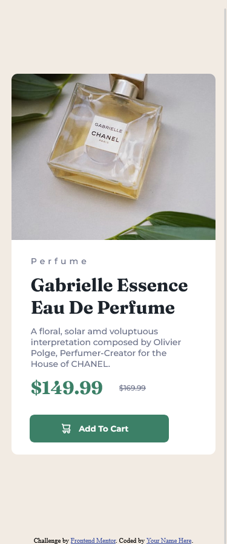

# Frontend Mentor - Product preview card component solution

This is a solution to the [Product preview card component challenge on Frontend Mentor](https://www.frontendmentor.io/challenges/product-preview-card-component-GO7UmttRfa). Frontend Mentor challenges help you improve your coding skills by building realistic projects. 

## Table of contents

- [Overview](#overview)
  - [The challenge](#the-challenge)
  - [Screenshots](#screenshots)
  - [Links](#links)
- [My process](#my-process)
  - [Built with](#built-with)
  - [What I learned](#what-i-learned)
  - [Continued development](#continued-development)
  - [Useful resources](#useful-resources)
- [Author](#author)

## Overview

### The challenge

Users should be able to:

- View the optimal layout depending on their device's screen size
- See hover and focus states for interactive elements

### Screenshots

### Links

- Solution URL: [Add solution URL here](https://your-solution-url.com)
- Live Site URL: [Add live site URL here](https://your-live-site-url.com)

## My process

### Built with

- Semantic HTML5 markup
- CSS custom properties
- Flexbox

### What I learned

Through this project, I have learned the use of clamp property to make images, fonts, widths, and heights responsive. The use of the clamp property has reduced my code. The code I use to write to make things responsive is now reduced to one line using the clamp property. I have also learned how to use the "srcset" attribute of the image tag in HTML, though I have not used it in this project.

### Continued development

The clamp property was very useful, and I will refine and perfect it.

### Useful resources

- [https://developer.mozilla.org/en-US/docs/Web/CSS/clamp](https://developer.mozilla.org/en-US/docs/Web/CSS/clamp) - This helped me for making things responsive. I really liked this property and will use it going forward.
- [https://developer.mozilla.org/en-US/docs/Learn/HTML/Multimedia_and_embedding/Responsive_images](https://developer.mozilla.org/en-US/docs/Learn/HTML/Multimedia_and_embedding/Responsive_images) - This is an amazing article which helped me finally understand how to use the "srcset". I'd recommend it to anyone still learning this concept.

## Author

- Frontend Mentor - [@Saadaan-Hassan](https://www.frontendmentor.io/profile/Saadaan-Hassan)
